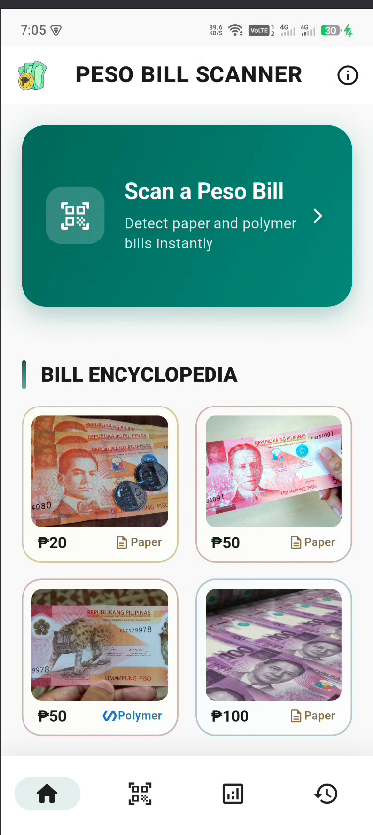
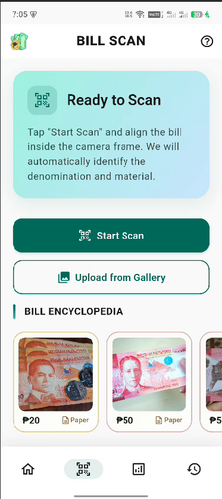
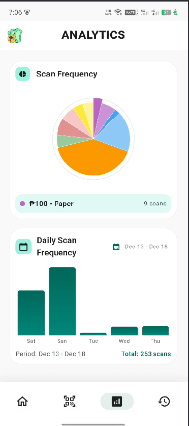
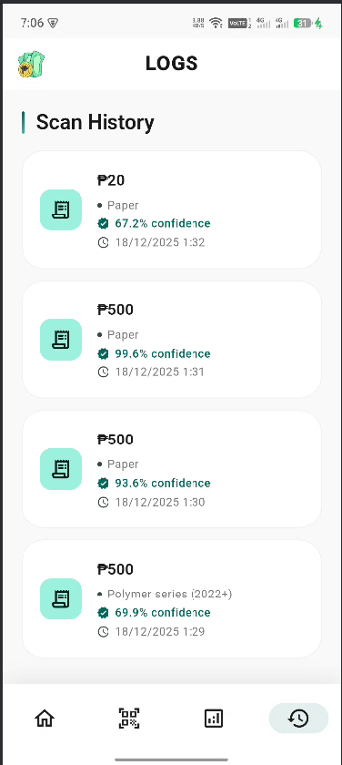

# Fidel Jotojot

### Frontend-Focused Web Developer | Vue.js • JavaScript • System-Based Projects

📍 Philippines · 🎓 3rd-Year IT Student  
📫 fideljotojot@gmail.com

---

## Professional Summary
Frontend-focused web developer with hands-on experience building Vue.js applications and full-stack academic systems. Strong foundation in JavaScript, responsive UI design, and backend integration. Actively seeking internship and entry-level opportunities to contribute to real-world projects and grow as a developer.

---

## Technical Skills
**Languages:** JavaScript, Python, PHP  
**Frontend:** HTML, CSS, Vue.js  
**Backend:** Node.js, Flask  
**Databases:** MySQL, NoSQL  
**Tools:** Git, GitHub  

---

## Selected Projects

**Peso Bills Scanner**  
A Flutter mobile application that uses machine learning to instantly detect and classify Philippine peso bills (paper and polymer). The app provides real-time denomination identification with confidence scoring, maintains detailed scan logs with timestamps, and displays analytics on scanning frequency patterns.  
*Flutter · Dart · TensorFlow Lite · Machine Learning*

### Features:
- **Bill Detection & Classification:** Instantly identify peso denominations (₱20, ₱50, ₱100, etc.) from camera or gallery images
- **Material Recognition:** Distinguish between paper and polymer bills with AI-powered analysis
- **Confidence Scoring:** Display prediction confidence levels for each scan
- **Scan Analytics:** Track daily scanning frequency with visual charts and statistics
- **Scan History:** Maintain detailed logs of all scanned bills with timestamps and confidence metrics
- **Bill Encyclopedia:** Educational reference guide showing all supported peso bill denominations

### App Screenshots:

  <table>
    <tr>
      <td width="25%"></td>
      <td width="25%"></td>
      <td width="25%"></td>
      <td width="25%"></td>
    </tr>
  </table>

---

**FindMyProf**  
A web-based system that helps students efficiently locate instructors and view availability, improving communication and accessibility.  
*Vue · JavaScript · Python · PHP*

**Marketplace Project**  
A marketing system where I developed responsive and user-friendly frontend components.  
*Vue · Laravel*

---

## GitHub Activity

---

## Contribution Activity

---

## Career Focus
- Frontend & Web Development  
- Vue.js and JavaScript Ecosystem  
- Internship and Entry-Level Developer Roles  
- Building practical, system-driven applications  

---

## Links
- GitHub: https://github.com/fideljotojot  
- Portfolio: Coming soon

---

Clean code • Practical systems • Continuous improvement

